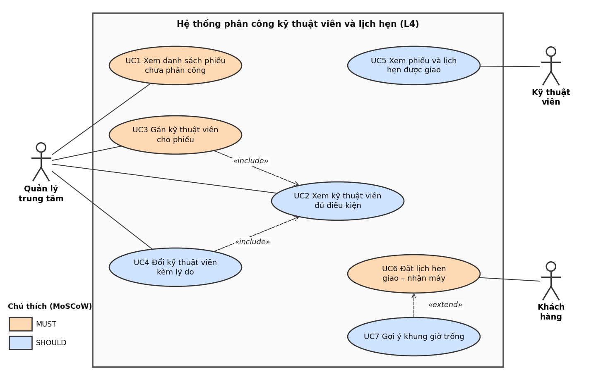

# SRS rút gọn – L4: Phân công kỹ thuật viên và lịch hẹn

**Sinh viên:** Viên Thành Đạt · **MSSV:** 2374802010107 · **Track:** SE · **Case study:** Smart CRM – Mekong Mobile  
**Học phần:** Chuyên đề Tốt nghiệp 1 – HK1 2026–2027 · **Phiên bản:** 1.2 (BT1) · **Ngày:** 10/10/2026  
**Repository:** <https://github.com/Sherbet0001/cdtn1-VienThanhDat-L4>

> Cấu trúc SRS rút gọn theo tinh thần ISO/IEC/IEEE 29148, không tuân thủ đầy đủ chuẩn. Bản này thay thế bản buổi 4: bỏ US8/FR10/UC8 (COULD, đưa vào hướng mở rộng) để còn 7 User Story; điền đầy đủ cột test case; bỏ “địa chỉ trung tâm” khỏi màn hình xác nhận vì mô hình dữ liệu L4 không có bảng trung tâm.

## 1. Giới thiệu và phạm vi

**Bối cảnh.** Mekong Mobile có 6 trung tâm bảo hành và 38 kỹ thuật viên. Việc phân công do quản lý làm thủ công theo trí nhớ nên khối lượng lệch nhau (có người nhận 40 phiếu/tháng, người khác 12 phiếu – vấn đề V3) và khoảng 15% phiếu quá hạn cam kết mà không được cảnh báo (V2).

**Luồng nghiệp vụ:** L4 – Phân công kỹ thuật viên và lịch hẹn.

**Phạm vi (một câu):** Quản lý trung tâm chọn kỹ thuật viên đủ tay nghề, cùng trung tâm và ít việc nhất để gán cho phiếu bảo hành mới, sau đó khách hàng đặt lịch hẹn giao – nhận máy với kỹ thuật viên đó và hệ thống chặn lịch trùng, kết thúc khi lịch hẹn được xác nhận.

**Chủ ý KHÔNG làm (WON'T) ở phiên bản này:**

- Tiếp nhận phiếu, phân loại sự cố, sinh hạn cam kết (thuộc L2; dùng dữ liệu phiếu mẫu có sẵn).
- Thuật toán tự động phân công tối ưu; đổi hoặc hủy lịch hẹn sau khi đã xác nhận.
- Xem lịch hẹn theo tuần của kỹ thuật viên (đưa vào hướng mở rộng, bỏ khỏi bản BT1 để SRS gọn).
- Gửi SMS/Zalo nhắc hẹn; kho linh kiện (L5); báo cáo tổng hợp (L6); quản lý tài khoản và phân quyền chi tiết.

**Bảng thuật ngữ** (mỗi khái niệm chỉ dùng một tên trong SRS, sơ đồ và API):

| Thuật ngữ | Ý nghĩa | Tên kỹ thuật |
| --- | --- | --- |
| Phiếu bảo hành | Yêu cầu bảo hành/sửa chữa, có mã duy nhất và vòng đời trạng thái | ticket |
| Trạng thái phiếu | MỚI → ĐÃ PHÂN CÔNG → ĐANG XỬ LÝ → CHỜ LINH KIỆN → HOÀN TẬT → ĐÃ ĐÓNG (hoặc ĐÃ HỦY) | status |
| Kỹ thuật viên (KTV) | Nhân viên sửa chữa, có tay nghề theo nhóm sự cố | technician |
| Tay nghề / mức thành thạo | Điểm 1–5 của KTV theo từng nhóm sự cố | technician_skill.proficiency |
| Nhóm sự cố | Màn hình, pin, sạc, phần mềm, nước vào, khác | issue_category |
| Hạn cam kết | Thời điểm chậm nhất phải hoàn tất phiếu | due_date |
| Quản lý trung tâm | Người phân công KTV của một trung tâm; gọi tắt là “quản lý” | center_manager (vai trò) |
| Khách hàng | Người mang thiết bị đến bảo hành; gọi tắt là “khách” | customer |
| Lịch hẹn | Khung giờ khách giao hoặc nhận máy với KTV (bảng bổ sung ngoài từ điển tham chiếu) | appointment |

## 2. Các bên liên quan và vai trò người dùng

| Vai trò (actor) | Được làm | Không được làm |
| --- | --- | --- |
| Quản lý trung tâm | Xem phiếu chưa phân công của trung tâm mình; xem KTV và khối lượng; gán, đổi KTV; xem số điện thoại đầy đủ. | Xem hoặc phân công phiếu của trung tâm khác; xóa phiếu. |
| Kỹ thuật viên | Xem phiếu và lịch hẹn được gán cho mình. | Xem phiếu người khác; tự gán/đổi phiếu; xem số điện thoại đầy đủ (chỉ thấy dạng che). |
| Khách hàng | Đặt lịch giao – nhận máy cho phiếu của chính mình (xác thực bằng mã phiếu + số điện thoại). | Xem thông tin khách khác; đặt lịch cho phiếu không phải của mình. |

## 3. Yêu cầu chức năng

### 3.1 Danh sách yêu cầu chức năng (9 FR)

| Mã | Yêu cầu chức năng | MoSCoW |
| --- | --- | --- |
| FR1 | Hệ thống hiển thị danh sách phiếu ở trạng thái MỚI chưa có KTV, thuộc trung tâm của quản lý, sắp theo hạn cam kết tăng dần. | MUST |
| FR2 | Với một phiếu, hệ thống liệt kê KTV đủ điều kiện (cùng trung tâm, đang hoạt động, mức thành thạo ≥ 3 với nhóm sự cố của phiếu) kèm số phiếu đang xử lý. | SHOULD |
| FR3 | Hệ thống gán một KTV cho phiếu, chuyển trạng thái MỚI → ĐÃ PHÂN CÔNG và ghi ticket_status_log trong một giao dịch. | MUST |
| FR4 | Hệ thống từ chối việc gán khi KTV không đủ điều kiện (khác trung tâm, thành thạo < 3, không hoạt động) hoặc khi phiếu đã có KTV, và nêu rõ lý do. | MUST |
| FR5 | Hệ thống cho đổi KTV của phiếu, bắt buộc nhập lý do, lưu KTV cũ/mới, thời điểm, người thực hiện. | SHOULD |
| FR6 | Hệ thống hiển thị cho KTV các phiếu và lịch hẹn được giao, sắp theo hạn cam kết; phiếu còn dưới 24 giờ đến hạn được đánh dấu. | SHOULD |
| FR7 | Hệ thống cho khách đặt lịch giao hoặc nhận máy cho phiếu của mình, chọn ngày và khung giờ trong giờ làm việc. | MUST |
| FR8 | Hệ thống từ chối lịch hẹn chồng khung giờ với lịch đã có của cùng KTV. | MUST |
| FR9 | Khi lịch hẹn bị từ chối vì trùng, hệ thống đề xuất ít nhất 3 khung giờ trống gần nhất. | SHOULD |

### 3.2 User Story (7 story: 3 MUST, 4 SHOULD)

| Mã | User Story | MoSCoW |
| --- | --- | --- |
| US1 | Là quản lý trung tâm, tôi muốn xem danh sách phiếu chưa phân công sắp theo hạn cam kết để ưu tiên giao phiếu sắp quá hạn trước (V2). | MUST |
| US2 | Là quản lý trung tâm, tôi muốn xem KTV phù hợp tay nghề kèm số phiếu đang giữ để chọn đúng người và tránh lệch tải (V3). | SHOULD |
| US3 | Là quản lý trung tâm, tôi muốn gán một KTV cho phiếu để mỗi phiếu có đúng một người chịu trách nhiệm. | MUST |
| US4 | Là quản lý trung tâm, tôi muốn đổi KTV của phiếu kèm lý do để lịch sử đổi người được lưu và truy được trách nhiệm. | SHOULD |
| US5 | Là kỹ thuật viên, tôi muốn xem phiếu và lịch hẹn được giao sắp theo hạn cam kết để ưu tiên xử lý phiếu sắp quá hạn (V2). | SHOULD |
| US6 | Là khách hàng, tôi muốn đặt lịch giao – nhận máy vào khung giờ KTV còn rảnh để không phải chờ đợi hoặc đến nhầm giờ. | MUST |
| US7 | Là khách hàng, tôi muốn được gợi ý các khung giờ trống gần nhất khi khung giờ mình chọn đã kín để đặt lại ngay mà không phải thử từng giờ. | SHOULD |

### 3.3 Tiêu chí chấp nhận (Given – When – Then) cho story MUST

**US1** – Là quản lý trung tâm, tôi muốn xem danh sách phiếu chưa phân công sắp theo hạn cam kết để ưu tiên giao phiếu sắp quá hạn trước (V2).

- AC1. GIVEN trung tâm Tân Bình có 12 phiếu MỚI chưa gán KTV, WHEN quản lý Tân Bình mở danh sách, THEN hiển thị đúng 12 phiếu, sắp theo hạn cam kết tăng dần.
- AC2. (ngoại lệ) GIVEN không còn phiếu MỚI nào, WHEN quản lý mở danh sách, THEN hiển thị “Không có phiếu cần phân công”.
- AC3. (phân quyền) GIVEN phiếu MỚI thuộc trung tâm Quận 10, WHEN quản lý Tân Bình mở danh sách, THEN phiếu đó không xuất hiện (QT-14).

**US3** – Là quản lý trung tâm, tôi muốn gán một KTV cho phiếu để mỗi phiếu có đúng một người chịu trách nhiệm.

- AC1. GIVEN phiếu BH001287/2026 ở trạng thái MỚI và KTV Trần Minh Khoa (cùng trung tâm, thành thạo MAN_HINH = 4), WHEN quản lý chọn Khoa và xác nhận, THEN phiếu chuyển ĐÃ PHÂN CÔNG, gắn với Khoa, và có một dòng log trạng thái trước/sau, thời điểm, người thực hiện.
- AC2. (ngoại lệ) GIVEN KTV có mức thành thạo 2 với nhóm sự cố của phiếu, WHEN quản lý cố gán, THEN hệ thống từ chối, nêu lý do theo QT-08 và phiếu giữ nguyên MỚI.
- AC3. (ngoại lệ) GIVEN hai quản lý cùng mở một phiếu, WHEN người thứ hai xác nhận sau khi người thứ nhất đã gán, THEN yêu cầu thứ hai bị từ chối, không ghi đè KTV đã gán.

**US6** – Là khách hàng, tôi muốn đặt lịch giao – nhận máy vào khung giờ KTV còn rảnh để không phải chờ đợi hoặc đến nhầm giờ.

- AC1. GIVEN phiếu BH001287/2026 đã gán cho Khoa và Khoa rảnh 09:00–09:30 ngày 12/10/2026, WHEN khách nhập đúng mã phiếu + số điện thoại và chọn khung giờ đó, THEN hệ thống lưu lịch hẹn ĐÃ XÁC NHẬN và hiển thị mã lịch hẹn, ngày giờ.
- AC2. (ngoại lệ) GIVEN Khoa đã có lịch 09:00–09:30 ngày 12/10/2026, WHEN khách khác chọn đúng khung đó, THEN hệ thống từ chối, không lưu và thông báo khung giờ đã kín.
- AC3. (ngoại lệ) GIVEN khách chọn khung giờ vào Chủ nhật hoặc sau 17:30, WHEN bấm xác nhận, THEN hệ thống từ chối và nêu khung giờ hợp lệ (BR-L4-01).

### 3.4 Kiểm tra INVEST và bốn lỗi thường gặp

| Story | I | N | V | E | S | T | Ghi chú |
| --- | --- | --- | --- | --- | --- | --- | --- |
| US1 | ✓ | ✓ | ✓ | ✓ | ✓ | ✓ | Độc lập: mở phiếu theo mã được khi chưa có danh sách |
| US2 | ✓ | ✓ | ✓ | ✓ | ✓ | ✓ | Giá trị gắn với vấn đề V3 (lệch tải) |
| US3 | ✓ | ✓ | ✓ | ✓ | ✓ | ✓ | Tách khỏi US4 (đổi người) để chấp nhận/từ chối riêng |
| US4 | ✓ | ✓ | ✓ | ✓ | ✓ | ✓ | Cần phiếu đã gán (điều kiện dữ liệu, không phải phụ thuộc story) |
| US5 | ✓ | ✓ | ✓ | ✓ | ✓ | ✓ | Chỉ đọc, kiểm thử được qua danh sách trả về |
| US6 | ✓ | ✓ | ✓ | ✓ | ✓ | ✓ | Chặn trùng lịch là tiêu chí AC2, không tách story |
| US7 | ✓ | ✓ | ✓ | ✓ | ✓ | ✓ | Tách khỏi US6 vì gợi ý khung giờ có thể làm sau |

Soi bốn lỗi: không có từ định tính mơ hồ; mỗi story có tiêu chí chấp nhận hoặc kiểm chứng được qua FR; mỗi story một việc; không nêu công nghệ hay giải pháp giao diện. Vai trò đều là người dùng hệ thống.

## 4. Yêu cầu phi chức năng (có ngưỡng đo được)

| Mã | Loại | Yêu cầu | Cách kiểm chứng |
| --- | --- | --- | --- |
| NFR1 | Hiệu năng | Danh sách phiếu chưa phân công (FR1) hiển thị trong dưới 2 giây với 10.000 phiếu, 20 dòng/trang, trên máy 8 GB RAM. | Nạp 10.000 phiếu mẫu, đo 20 lần, lấy giá trị lớn nhất. |
| NFR2 | Hiệu năng | Kiểm tra trùng lịch (FR8) trả kết quả trong dưới 1 giây với 5.000 lịch hẹn. | Nạp 5.000 lịch hẹn mẫu, đo 50 lần gọi. |
| NFR3 | Tin cậy | Gán/đổi KTV và đặt lịch thực hiện theo giao dịch. Khi 2 khách đặt cùng khung giờ của cùng một KTV đồng thời, đúng 1 yêu cầu thành công và 0 lịch trùng được lưu qua 100 lần thử. | Kịch bản kiểm thử đồng thời 100 lần. |
| NFR4 | Bảo mật | 100% yêu cầu truy cập phiếu ngoài trung tâm hoặc ngoài quyền vai trò bị từ chối (HTTP 403); số điện thoại hiển thị dạng che (090****567) với mọi vai trò trừ quản lý. | Test phân quyền cho từng vai trò, mỗi vai trò ≥ 5 ca. |
| NFR5 | Khả dụng | Quản lý mới dùng gán đúng một KTV cho một phiếu trong dưới 1 phút, không quá 4 lần bấm, không cần hỏi đồng nghiệp. | 3 người chưa dùng hệ thống, bấm giờ. |

## 5. Ràng buộc và quy tắc nghiệp vụ

| Mã | Quy tắc | Nguồn |
| --- | --- | --- |
| QT-04 | Hạn cam kết sinh theo mức ưu tiên (CAO 24h, TRUNG_BINH 72h, THAP 120h), chỉ tính thứ Hai–thứ Bảy; dùng để sắp xếp và đánh dấu phiếu sắp quá hạn. | Case study, Mục 9 |
| QT-06 | Phiếu chỉ chuyển trạng thái theo đúng vòng đời, không quay lại; mọi lần chuyển ghi vào ticket_status_log. | Case study, Mục 9 |
| QT-07 | Một phiếu tại một thời điểm chỉ gán cho tối đa một KTV; đổi KTV phải ghi lý do. | Case study, Mục 9 |
| QT-08 | Chỉ phân công KTV cùng trung tâm và có mức thành thạo ≥ 3 với nhóm sự cố của phiếu. | Case study, Mục 9 |
| QT-13/14/15 | Không xóa vật lý; chỉ xem dữ liệu đơn vị mình; số điện thoại che với mọi vai trò trừ quản lý. | Case study, Mục 9 |
| BR-L4-01 | Lịch hẹn dài 30 phút, bắt đầu đúng mốc :00 hoặc :30, trong giờ làm việc 08:00–17:30 (khung cuối bắt đầu 17:00), thứ Hai–thứ Bảy, không đặt vào quá khứ. | Giả định của sinh viên |
| BR-L4-02 | Một KTV không có hai lịch hẹn chồng khung giờ. Hẹn giao máy chỉ khi phiếu ở ĐÃ PHÂN CÔNG trở đi; hẹn nhận máy chỉ khi phiếu HOÀN TẬT. | Giả định của sinh viên |
| BR-L4-03 | Khách chỉ đặt lịch cho phiếu của chính mình; phiếu ĐÃ ĐÓNG hoặc ĐÃ HỦY không đặt lịch được. | Giả định của sinh viên |

## 6. Bảng truy vết yêu cầu

| FR | Yêu cầu (tóm tắt) | User Story | Use Case | API endpoint | NFR / quy tắc | Test case (BT3) |
| --- | --- | --- | --- | --- | --- | --- |
| FR1 | Xem phiếu chưa phân công | US1 | UC1 | GET /api/tickets/unassigned | NFR1, NFR4, QT-04, QT-14 | TC-01, TC-02, TC-13 |
| FR2 | Xem KTV đủ điều kiện + khối lượng | US2 | UC2 | GET /api/tickets/{id}/eligible-technicians | QT-08 | TC-03 |
| FR3 | Gán KTV cho phiếu | US3 | UC3 | POST /api/tickets/{id}/assignment | NFR3, NFR5, QT-06, QT-07 | TC-04 |
| FR4 | Từ chối gán khi không hợp lệ | US3 | UC3 | POST /api/tickets/{id}/assignment (400, 409) | QT-07, QT-08 | TC-05, TC-06 |
| FR5 | Đổi KTV kèm lý do | US4 | UC4 | PUT /api/tickets/{id}/assignment | QT-07 | TC-07 |
| FR6 | KTV xem phiếu và lịch được giao | US5 | UC5 | GET /api/technicians/me/tasks | NFR4, QT-04, QT-15 | TC-08, TC-14 |
| FR7 | Khách đặt lịch giao – nhận máy | US6 | UC6 | POST /api/appointments | BR-L4-01, BR-L4-02, BR-L4-03 | TC-09 |
| FR8 | Chặn lịch hẹn trùng | US6 | UC6 | POST /api/appointments (409) | NFR2, NFR3, BR-L4-02 | TC-10, TC-11 |
| FR9 | Gợi ý ≥ 3 khung giờ trống | US7 | UC7 | POST /api/appointments/available-slots | NFR2 | TC-12 |

**Nội dung test case** (mô tả ngắn; kịch bản chi tiết viết ở BT3):

| Mã | Nội dung kiểm thử |
| --- | --- |
| TC-01 | 12 phiếu MỚI của trung tâm hiển thị đúng thứ tự hạn cam kết tăng dần. |
| TC-02 | Không có phiếu MỚI → thông báo “Không có phiếu cần phân công”. |
| TC-03 | Chỉ KTV cùng trung tâm, đang hoạt động, thành thạo ≥ 3 được liệt kê, sắp theo số phiếu đang giữ. |
| TC-04 | Gán hợp lệ → phiếu ĐÃ PHÂN CÔNG, có technician_id và đúng một dòng ticket_status_log. |
| TC-05 | KTV thành thạo 2 hoặc khác trung tâm → 400 TECH_NOT_ELIGIBLE, phiếu giữ MỚI. |
| TC-06 | Hai quản lý gán cùng phiếu → yêu cầu sau nhận 409 TICKET_ALREADY_ASSIGNED. |
| TC-07 | Đổi KTV có lý do → 200 và log KTV cũ/mới; thiếu lý do → 400. |
| TC-08 | KTV chỉ thấy phiếu của mình; phiếu còn dưới 24 giờ có due_soon = true. |
| TC-09 | Đặt lịch hợp lệ → 201, trạng thái DA_XAC_NHAN, kết thúc sau đúng 30 phút. |
| TC-10 | Đặt khung giờ đã có lịch → 409 SLOT_CONFLICT, không lưu. |
| TC-11 | 100 yêu cầu đồng thời cùng khung giờ → đúng 1 thành công, 0 lịch trùng (NFR3). |
| TC-12 | Khung giờ kín → trả ít nhất 3 khung trống gần nhất. |
| TC-13 | 10.000 phiếu mẫu: danh sách 20 dòng/trang phản hồi dưới 2 giây (NFR1). |
| TC-14 | KTV/quản lý truy cập phiếu ngoài quyền → 403; SĐT hiển thị dạng che (NFR4). |

## Phụ lục A. Use Case Diagram

File gốc: `docs/usecase.drawio` (ảnh xem nhanh: `docs/usecase.png`).

**Chú thích.** 3 actor: Quản lý trung tâm (UC1–UC4), Kỹ thuật viên (UC5), Khách hàng (UC6). UC3 và UC4 luôn cần danh sách KTV phù hợp nên «include» UC2. UC7 chỉ xảy ra khi UC6 phát hiện trùng lịch nên «extend» UC6. Nền cam: MUST; nền xanh: SHOULD.

## Phụ lục B. Đặc tả use case

### UC3 – Gán kỹ thuật viên cho phiếu (use case quan trọng nhất)

| Mục | Nội dung |
| --- | --- |
| Actor chính | Quản lý trung tâm |
| Mục tiêu | Giao một phiếu mới cho đúng một KTV phù hợp để phiếu có người chịu trách nhiệm. |
| Điều kiện trước | Quản lý đã đăng nhập; phiếu ở trạng thái MỚI, chưa có KTV, thuộc trung tâm của quản lý. |
| Điều kiện sau | Phiếu có technician_id, trạng thái ĐÃ PHÂN CÔNG; một dòng ticket_status_log được ghi. |
| Liên quan | US1, US2, US3 · FR1–FR4 · QT-06, QT-07, QT-08 · MUST |

**Luồng chính**

1. Quản lý mở danh sách phiếu chưa phân công (UC1).
2. Quản lý chọn một phiếu.
3. Hệ thống hiển thị chi tiết phiếu (mã, nhóm sự cố, ưu tiên, hạn cam kết) và danh sách KTV đủ điều kiện kèm số phiếu đang giữ, sắp tăng dần theo số phiếu. [include UC2]
4. Quản lý chọn một KTV.
5. Quản lý bấm “Xác nhận phân công”.
6. Hệ thống kiểm tra phiếu còn MỚI chưa có người và KTV vẫn đủ điều kiện.
7. Hệ thống lưu KTV, chuyển trạng thái sang ĐÃ PHÂN CÔNG, ghi log trong một giao dịch và báo thành công.

**Luồng ngoại lệ** (số bước tương ứng luồng chính)

- **3a.** Không có KTV đủ điều kiện → thông báo “Không có kỹ thuật viên phù hợp”, phiếu giữ nguyên MỚI; quản lý xử lý ngoài hệ thống.
- **4a.** Quản lý chọn KTV không đủ điều kiện (khác trung tâm hoặc thành thạo < 3) → từ chối, nêu lý do theo QT-08.
- **6a.** Phiếu vừa được quản lý khác gán → từ chối, không ghi đè, tải lại và hiển thị KTV hiện tại.
- **7a.** Mất kết nối hoặc lỗi khi lưu → hoàn tác giao dịch, phiếu giữ MỚI, cho phép thử lại, không ghi log trùng.

### UC6 – Đặt lịch hẹn giao – nhận máy

| Mục | Nội dung |
| --- | --- |
| Actor chính | Khách hàng |
| Mục tiêu | Hẹn khung giờ giao máy cho KTV (hoặc nhận máy sau khi sửa xong) mà không trùng lịch. |
| Điều kiện trước | Phiếu đã có KTV: ĐÃ PHÂN CÔNG trở đi (giao máy) hoặc HOÀN TẬT (nhận máy); khách biết mã phiếu và số điện thoại đã đăng ký. |
| Điều kiện sau | Một lịch hẹn ĐÃ XÁC NHẬN được lưu, gắn với phiếu và KTV, không chồng khung giờ với lịch nào khác của KTV đó. |
| Liên quan | US6, US7 · FR7–FR9 · BR-L4-01..03 · NFR2, NFR3 · MUST |

**Luồng chính**

1. Khách nhập mã phiếu và số điện thoại.
2. Hệ thống xác thực, hiển thị phiếu, KTV phụ trách và các loại hẹn hợp lệ.
3. Khách chọn loại hẹn (giao máy hoặc nhận máy).
4. Khách chọn ngày và khung giờ.
5. Hệ thống kiểm tra khung giờ không chồng lịch của KTV.
6. Khách bấm “Xác nhận đặt lịch”.
7. Hệ thống lưu lịch hẹn, hiển thị mã lịch hẹn, tên KTV, loại hẹn, ngày giờ.

**Luồng ngoại lệ** (số bước tương ứng luồng chính)

- **2a.** Mã phiếu và số điện thoại không khớp → từ chối bằng thông báo chung, không tiết lộ phiếu có tồn tại hay không.
- **2b.** Phiếu chưa có KTV, hoặc đã ĐÃ ĐÓNG/ĐÃ HỦY → thông báo không thể đặt lịch.
- **4a.** Khung giờ ở quá khứ, ngoài 08:00–17:30 hoặc vào Chủ nhật → từ chối, nêu khung giờ hợp lệ (BR-L4-01).
- **5a.** Khung giờ trùng lịch của KTV → không lưu, hiển thị ít nhất 3 khung giờ trống gần nhất [extend UC7]; khách chọn lại và quay về bước 5.
- **5b.** Không còn khung trống trong 7 ngày tới → thông báo và đề nghị chọn ngày khác.
- **6a.** Hai khách xác nhận cùng khung giờ của cùng KTV gần như đồng thời → chỉ một yêu cầu thành công; người còn lại nhận kết quả như 5a.
- **7a.** Mất kết nối khi lưu → giữ lại lựa chọn trên màn hình, cho phép thử lại, không tạo lịch hẹn trùng.

## Phụ lục C. Đặc tả riêng theo track SE

Xem `docs/api-contract.md` (hợp đồng API), `docs/schema.sql` (DDL) và `docs/erd.drawio` (ERD).
